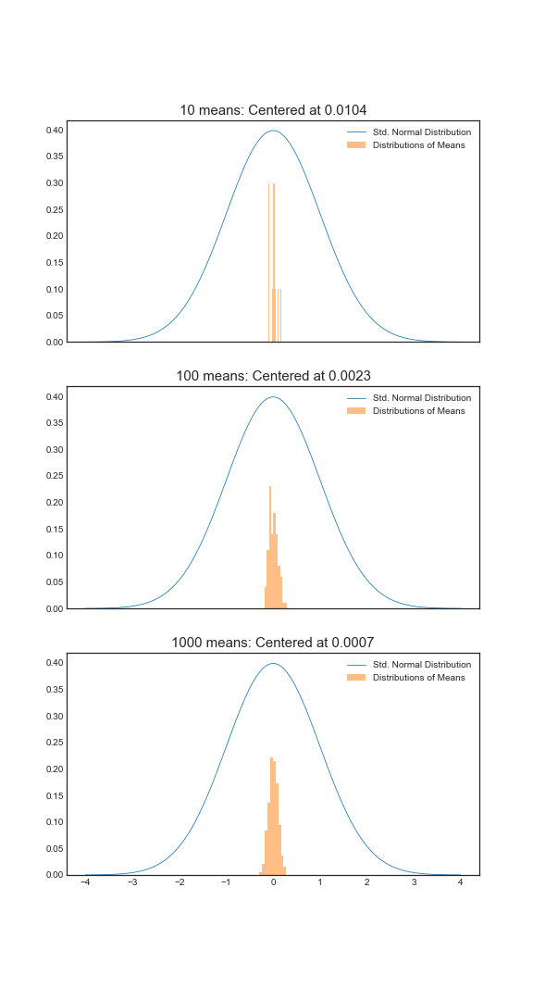

# Week 1

### Probability

Given a random experiment (say, rolling a die), a probability measure is a population quantity that summarizes the randomness.

Specifically, probability takes a possible outcome from the experiment and:

- assigns it a number between $0$ and $1$ ;
- so that the probability that something occurs is $1$ and;
- so that the probability of the union of any two sets of outcomes that have nothing in common (mutually exclusive) is the sum of their respective probabilities.

**Rules probability must follow**

The probability that nothing occurs is $0$ : $\textrm P (\Omega^{\textrm C}) = \textrm P (\varnothing) = 0$ .

The probability that something occurs is $1$: $\textrm P (\Omega) = 1$ .

The probability of something is $1$ minus the probability that the  opposite occurs: $\textrm P (A^{\textrm C}) = 1 - \textrm P (A)$

The probability of at least one of two (or more) things that cannot simultaneously occur (mutually exclusive) is the sum of their respective probabilities: $A \perp B \Rightarrow \textrm P(A \cup B) = \textrm P (A) + \textrm P (B)$ .

If an event $A$ implies the occurrence of event $B$, then the probability of $A$ is less than the probability that $B$ occurs: $A \in B \Rightarrow \textrm P(B) \geq \textrm P (A)$ .

For any two events, the probability that at least one occurs is the sum of their probabilities minus their intersection: $\textrm P (A \cup B) = \textrm P (A) + \textrm P (B) - \textrm P (A \cap B),\ \forall A, B \in \Omega$ .

***

#### Random variables

A random variable is a numerical outcome of an event.

- It can be <u>discrete</u> or <u>continuous</u>.

##### Probability Mass Function (PMF)

A probability mass function evaluated at a value $x$ corresponds to the probability that a random variable $X$ takes that value: $p(x) = p(X=x)$ .

To be a valid PMF, a function $p$ must satisfy:

1. It must always be larger or equal to $0$: $p(x) \geq 0,\ \forall x \in \Omega$ .
2. The sum of the possible values that the random variable can take has to add up to one: $\displaystyle\sum_{x\ \in\ \Omega} p(x) = 1$ .

###### Example:

$X=0$ represents tails and $X=1$ represents heads.
$$
p(x) = \theta^x (1-\theta)^{1-x}, \ x\in\{0,1\}
$$

##### Probability Density Function (PDF)

A probability density function is a function associated with a continuous variable.

To be a valid PDF, a function $f$ must satisfy:

1. It must be larger than or equal to zero everywhere: $f(x) \geq 0, \ \forall x \in \textrm{Dom} (X)$ .
2. The total area under it must be one: $\displaystyle\int_\Omega f(x) dx = 1$ .

Areas under PDFs correspond to probabilities for that random variable: $f(a \leq X \leq b) = \displaystyle\int_a^b f(x) dx$ .

###### Example:

$$
f(x) =
\begin{cases}
2x, & 0 < x < 1 \\
0, & \textrm{otherwise}
\end{cases}
$$

Special case of the [Beta distribution](https://en.wikipedia.org/wiki/Beta_distribution): $f(x\ |\ \alpha, \beta) = c \cdot x^{\alpha-1} (1-x)^{\beta-1}$ , with the constant $c = 2$, $\alpha = 2$ and $\beta = 1$ .

##### Cumulative Density Function (CDF) and Survival Function

The cumulative distribution function (CDF) of a random variable $X$ returns the probability that the random variable is less than or equal to the value $x$ :
$$
F(x) = \textrm P(X \leq x)
$$

> It is important to note that $\displaystyle\frac{d}{dx} F(x) = f(x) \Leftrightarrow F(x) = \displaystyle\int f(x)dx$ .

The survival function of a random variable $X$ is defined as the probability that the random variable is greater than the value $x$ :
$$
S(x) = \textrm P (X > x)
$$
Note that $S(x) = 1 - F(x)$ .

##### Quantiles

The $\alpha$-th quantile of a distribution with a CDF $F$ is the point $x_{\alpha}$ so that:
$$
F(x_{\alpha}) = \alpha
$$

***

We are referring to <u>population quantities</u>. Therefore, the median being discussed is the population median.

- A probability model connects the data to the population using assumptions.
- Therefore, the median we are discussing is the <u>estimand</u>, the sample median will be the <u>estimator</u>.

***

#### Conditional probability

Let $B$ be an event so that $\textrm P (B) > 0$ .

Then, the conditional probability of an event $A$, given that $B$ has occurred is:
$$
\textrm P (A|B) = \displaystyle\frac{\textrm P (A \cap B)}{\textrm P (B)}
$$
If $A$ and $B$ are <u>independent</u>, that is, $A \perp B$ : $\textrm P(A \cap B) = \textrm P(A) \textrm P(B)$ .

- Then, $\textrm P (A|B) = \displaystyle\frac{\textrm P (A) \textrm P (B)}{\textrm P(B)} = \textrm P (A)$ .

##### Bayes' rule

$$
\textrm P (B|A) = \displaystyle\frac{\textrm P (A|B) \textrm P (B)}{\textrm P (A|B) \textrm P (B) + \textrm P(A|B^{\textrm C}) \textrm P (B^{\textrm C})}
$$

###### Example

Let $+$ and $-$ be the events that the result of a diagnostic test is positive or negative, respectively.

Let $D$ and $D^{\textrm C}$ be the events that the subject of the test has or does not have the disease, respectively.

The sensitivity is the probability that the test is positive, given that the subject has the disease, that is, $\textrm{Sensitivity } = \textrm P (+|D)$ .

The specificity is the probability that the test is negative, given that the subject does not have the disease, *id est*, $\textrm{Specificity } = \textrm P (-|D^{\textrm C})$ .

If a positive test is obtained, one may be interested in the positive predictive value: $\textrm P(D|+)$ .

If a negative test is obtained, one may be interested in the negative predictive value: $\textrm P (D^{\textrm C} | -)$ .

In the absence of a test, the probability of presenting the disease $\textrm P(D)$ is called the prevalence of disease.

> Suppose that a test for a disease had sensitivity of $99.7\%$ and specificity of $98.5\%$. Suppose that a subject from a population with a $0.1\%$ prevalence of that disease receives a positive test result. What is the associated positive predictive value?

<i>Using Bayes' formula</i>:
$$
\textrm P (D|+) = \displaystyle\frac{\textrm P (+|D) \textrm P (D)}{\textrm P (+|D) \textrm P (D) + \textrm P (+|D^{\textrm C}) \textrm P (D^{\textrm C})}
$$
*Knowing that* $\textrm P (+ | D^{\textrm C}) = 1-\textrm P (-|D^{\textrm C})$ *and* $\textrm P (D^{\textrm C}) = 1 - \textrm P (D)$ :
$$
\begin{align}
\textrm P (D|+) & = \displaystyle\frac{\textrm P (+|D) \textrm P (D)}{\textrm P (+|D) \textrm P (D) + \bigg[1 - \textrm P (-|D^{\textrm C})\bigg]\bigg[1 - \textrm P (D) \bigg]} \\
& = \displaystyle\frac{.997 \times .001}{.997 \times .001 + .015 \times .999} = .062
\end{align}
$$

##### Likelihood ratios

$$
\displaystyle\frac{\textrm P (D|+)}{\textrm P (D^{\textrm C}|+)} = \displaystyle\frac{\textrm P (+|D)}{\textrm P (+|D^{\textrm C})} \times \displaystyle\frac{\textrm P (D)}{\textrm P (D^{\textrm C})}
$$

- $\displaystyle\frac{\textrm P (D|+)}{\textrm P (D^{\textrm C}|+)}$ : odds of disease given a positive test result.

- $\displaystyle\frac{\textrm P (D)}{\textrm P (D^{\textrm C})}$ : odds of disease in the absence of a test result.

- $\displaystyle\frac{\textrm P (+|D)}{\textrm P (+|D^{\textrm C})}$ : diagnostic likelihood ratio for a positive test result $\textrm{DLR}_{+}$.

$\textrm{post-test odds of } D = \textrm{DLR}_{+} \times \textrm{ pre-test odds of } D$

> The diagnostic likelihood ratio of a positive test result $\textrm{DLR}_{+}$ is the factor by which you multiply your odds, in the presence of a positive test, to obtain your post-test odds.

###### Example

Returning to the previous example:

$\textrm{DLR}_{+} = \displaystyle\frac{.997}{1 - .985} \approx 66$

> The hypothesis of disease is $66$ times more supported by the data than the hypothesis of no disease, given a positive test result.

$\textrm{DLR}_{-} = \displaystyle\frac{1-.997}{.985} \approx .003$

> The hypothesis of disease is supported $0.003$ times that of the hypothesis of the absence of disease, given the negative test result.

##### Independence

Event $A$ is independent of event $B$ if $\textrm P (A \cap B) = \textrm P (A) \textrm P (B) \Leftrightarrow \textrm P (A|B) = \textrm P (A)$

##### Independent and identically distributed (IID) variables

<u>Independent</u>: statistically unrelated from one another.

<u>Identically distributed</u>: all having been drawn from the same population distribution.

***

#### Expected values

Our sample expected values will estimate the population versions.

##### The population mean

The expected value $E[X]$ or mean of a random variable $X$ is the center of its distribution.

$E[X]$ represents the center of mass of a collection of locations and weights, $\{x, p(x)\}$.

For a discrete random variable $X$ : $\textrm E[X] = \displaystyle\sum_{x} x p(x)$ .

For a continuous random variable $X$ : $\textrm E[X] = \displaystyle\int_{-\infty}^{\infty} x f(x) dx$ .

##### The sample mean

The center of mass of the data is the empirical mean.

For a random variable $X$: $\bar X = \displaystyle\sum^n_{i=1} x_i p(x_i)$ . 

###### Examples:

Coin flip: suppose that random variable $X$ is so that $\textrm P (X = 1) = p$ and $\textrm P (X=0) = 1-p$.

- Then, $\textrm E [X] = 0 \times (1-p) + 1 \times p = p$ .

Die roll: suppose that a die is rolled and $X$ is the number face up.

- Then, $\textrm E[X] = 1 \times \displaystyle\frac{1}{6} + 2 \times \displaystyle\frac{1}{6} + 3 \times \displaystyle\frac{1}{6} + 4 \times \displaystyle\frac{1}{6} + 5 \times \displaystyle\frac{1}{6} + 6 \times \displaystyle\frac{1}{6} = 3.5$

**Facts about expected values**

- Expected values are properties of distributions.
- The average of random variables is itself a random variable and its associated distribution has an expected value.
  - <u>The center of this distribution is the same as that of the original distribution.</u>
  - The expected value of the sample mean is exactly the population mean that it is trying to estimate: $\textrm E[\bar X] = E[X]$ .
  - The more data goes into the sample mean, the more concentrated its density/mass function is around the population mean.

> When the distribution of an estimator $\hat\theta$ is centered at the same point as the estimand $\theta$, that is, when $\textrm E[\hat\theta] = \theta$, the estimator is said to be <u>unbiased</u>. More [here](https://en.wikipedia.org/wiki/Bias_of_an_estimator).

