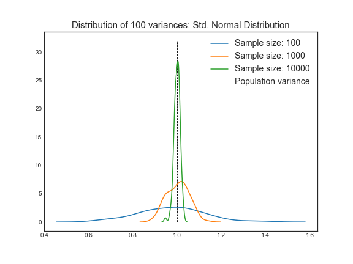
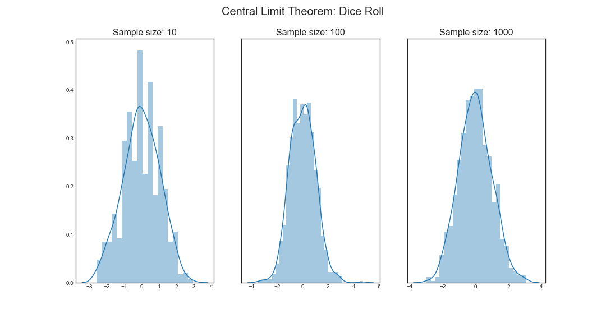
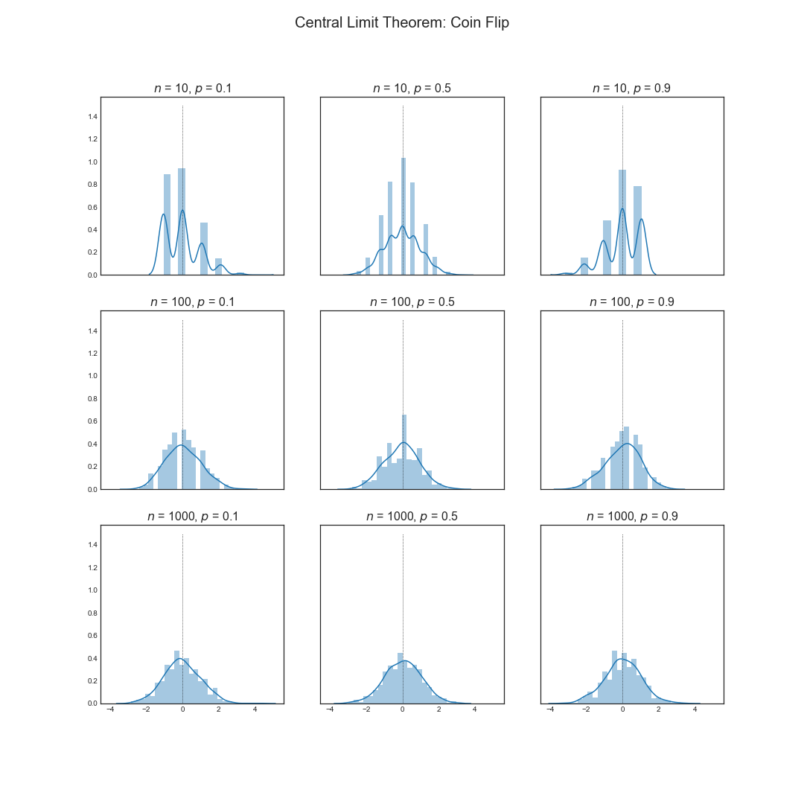
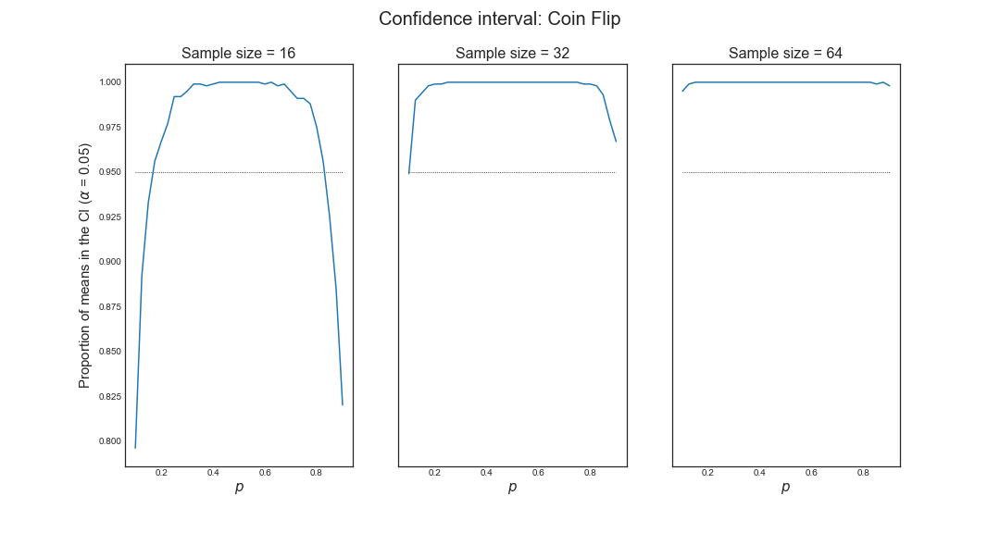

# Week 2

#### Variance

##### The population variance

The variance of a random variable is a measure of spread.
$$
\textrm{Var}(X) = \textrm E[(X-\mu)^2] = \textrm E[X^2] - \textrm E[X]^2
$$
where $\textrm E[X^2] = \displaystyle\sum_{x \in \Omega} x^2 p(x)$, for discrete variable, or $\textrm E[X^2] = \displaystyle\int_\Omega x^2 f(x)dx$, for continuous variables.

The square root of the variance is called **standard deviation**.

##### The sample variance

The sample variance is the average squared distance of each observed data point to the sample mean.
$$
S^2 = \displaystyle\frac{1}{n-1}\sum_{i} (X_i - \bar X)^2
$$
The square root of the sample variance is the sample standard deviation.

- The sample variance is a random variable;
- As such, it has an associate population distribution;
- Whose expected value is the population variance.
- More data will produce a more concentrated distribution around the expected value (population variance).

**Recall the mean**

Recall that the average of a random sample from a population is itself a  random variable.
$$
\textrm E [\bar X] = \mu
$$
where $\mu$ is the population mean.

So, the variance of the sample mean decreases to zero as it accumulates more data:
$$
\textrm{Var}(\bar X) = \displaystyle\frac{\sigma^2}{n}
$$
where $\sigma^2$ is the population variance and $n$, the sample size.

We cal the standard deviation of a statistic a <u>standard error</u>.

- So, the square root of the variation of the mean is the standard error of the mean.

Since the variance of the sample mean is $\displaystyle\frac{\sigma^2}{n}$:

- Its logical estimate is $\displaystyle\frac{s^2}{n}$;
- The logical estimate of the standard error is $\displaystyle\frac{S}{\sqrt{n}}$ .
- The standard error talks about how variable averages of random samples of size $n$ from the population are.

##### Facts about the variance

- $\begin{align} \textrm{Var}(aX) & = \textrm E[(aX)^2] - \big(\textrm E[aX]\big)^2 \\ & = \textrm E [a^2 X^2] - \big(a \textrm E[X]\big)^2 \\ & = a^2 \textrm E[X^2] - a^2 \big( \textrm E[X] \big)^2 \\ & = a^2 \textrm{Var}(X)\end{align}$
- The sample variance estimates the population variance;
- The distribution of the sample variance is centered at what it is estimating (the population variance);
  - This means that the sample variance is unbiased;
  - The distribution gets more concentrated around the population variance with larger sample sizes;
- The variance of the sample mean is the population mean divided by the sample size: $\textrm{Var}(\bar X) = \displaystyle\frac{\sigma^2}{n}$.
  - Its square root $\displaystyle\frac{\sigma}{\sqrt{n}}$ is the standard error of the mean.

***

### Distributions

#### Bernoulli distribution

The Bernoulli distribution arises as the result of a binary outcome.

Bernoulli random variables take only the values $1$ and $0$, with probabilities $p$ and $1-p$, respectively.

PMF:
$$
\textrm P (X=x) = p^x (1-p)^{1-x}
$$

- The mean of a Bernoulli random variable is $p$ ;
- The variance is $p (1-p)$ .

##### Binomial distribution

Let $X_1, X_2, ..., X_n$ be i.i.d. $\textrm{Bernoulli}(p)$.

Then, $X = \displaystyle\sum_{i=1}^n X_i$ is a binomial random variable.

PMF:
$$
\textrm P (X=x) =
\begin{pmatrix}
n \\ x
\end{pmatrix}
p^x (1-p)^{n-x}
$$
where $\begin{pmatrix} n \\ x \end{pmatrix} = \displaystyle\frac{n!}{x! (n-x)!}$ .

- The mean of a binomial random variable is $np$ ;
- The variance is $np(1-p)$ .

##### Normal distribution

A random variable is said to follow a normal (or Gaussian) distribution ($X \sim \mathcal N (\mu, \sigma^2)$) with mean $\mu$ and variance $\sigma^2$ if its PDF is given by:
$$
f(x) = \displaystyle\frac{1}{\sqrt{2\pi\sigma^2}}\  \textrm{e}^{-\displaystyle\frac{(x-\mu)^2}{2\sigma^2}}
$$

with $\textrm E[X] = \mu$ and $\textrm{Var}(X)=\sigma^2$.

- The distribution for which $\mu = 1$ and $\sigma = 1$ is known as standard normal distribution (often labeled $z$).

- The area under the curve between $\mu - \sigma$ and $\mu + \sigma$, that is, the probability $\textrm P \big(\mu-\sigma \leq X \leq \mu + \sigma\big)$ is approximately $0.6827$ (or $68.27\%$).
- The probability $\textrm P \big( \mu - 2\sigma \leq X \leq \mu + 2\sigma \big)$ is approximately $0.9545$ (or $95.45\%$).
- The probability $\textrm P \big( \mu - 3\sigma \leq X \leq \mu + 3\sigma \big)$ is approximately $0.9973$ (or $99.73\%$).

**Facts about the normal distribution**:

- If $X \sim \mathcal N (\mu, \sigma^2)$, then $Z = \displaystyle\frac{X-\mu}{\sigma} \sim \mathcal N (0,1)$.
- If $Z$ is a standard normal variable, then $X = \mu + \sigma Z \sim \mathcal N (\mu, \sigma^2)$.

- The values $-1.28$, $-1.645$, $-1.96$ and $-2.33$ are, respectively, the $10^{\textrm{th}}$, $5^{\textrm{th}}$, $2.5^{\textrm{th}}$, and $1^{\textrm{st}}$ percentiles of the standard normal distribution.
- By symmetry,  $1.28$, $1.645$, $1.96$ and $2.33$ are, respectively, the $90^{\textrm{th}}$, $95^{\textrm{th}}$, $97.5^{\textrm{th}}$, and $99^{\textrm{th}}$ percentiles of the standard normal distribution.

###### Question:

What is the $95^{\textrm{th}}$ percentile of a $\mathcal N (\mu, \sigma^2)$ distribution?
$$
z_p = \displaystyle\frac{x_p - \mu}{\sigma} ,
$$
where $z_p$ is the $p^{\textrm{th}}$ percentile of the standard normal distribution.

- For the $95^{\textrm{th}}$ percentile, $z_p = 1.96$, as seen above.
- Then, $x_p$, the $95^{\textrm{th}}$ percentile of the normal distribution of mean $\mu$ and variance $\sigma^2$, is given by: $x_p = \mu + 1.96 \sigma$.

#### Poisson distribution

Used to model counts.

PMF:
$$
\textrm P (X=x;\lambda) = \displaystyle\frac{\lambda^x \textrm e^{-\lambda}}{x!}
$$
with $x \in \N$.

- The mean of this distribution is $\lambda$.
- The variance, too, is $\lambda$.

Some uses for the Poisson distribution:

- Modeling count data;
- Modeling event-time or survival data;
- Modeling contingency tables;
- Approximating binomials when $n$ is large and $p$ is small.

Rates and Poisson random variables:

- Poisson random variables are used to model rates;
- $X \sim \textrm{Poisson}(\lambda t)$ where:
  - $\lambda = \textrm E\bigg[ \displaystyle\frac{X}{t} \bigg]$ is the expected count per unit of time;
  - $t$ is the total monitoring time.

Poisson approximation to the binomial:

- Let $X \sim \textrm{Binomial}(n,p)$.
- For $n \gg 1$ and $p \ll 1$, $X$ can be approximated by a Poisson distribution, with $\lambda = np$.

***

### Asymptotics

Asymptotics is the term for the behavior of statistics as the sample size (or some other quantity) limits to infinity (or some other relevant number).

##### Limits of random variables

These results allows us to talk about the large sample distribution of sample means of a collection of i.i.d. observations.

The first of these results, the [Law of Large Numbers](https://en.wikipedia.org/wiki/Law_of_large_numbers) (LLN), we intuitively know:

- It says that the average limits to what it is estimating, the population mean.
  - For instance, let $\bar X_n$ be the average of the result of $n$ coin flips.
  - As we flip a coin over and over, it eventually converges to the expected value, that is, $\bar X_n \rightarrow \mu\ \because\ n \rightarrow \infty$.
- According to the LLN, the sample mean of i.i.d. samples is a consistent estimator of the population mean.
  - The sample variance and the sample standard deviation are consistent, as well.

> An estimator is said to be <u>consistent</u> if it converges, as the sample size grows, to the estimand.

#### The Central Limit Theorem

For our purposes, the [CLT](https://en.wikipedia.org/wiki/Central_limit_theorem) states that the distribution of averages of i.i.d. variables (properly normalized) becomes that of a standard normal, as the sample size increases.

The idea is that, for an estimate, subtracting the mean of that estimate and dividing by the standard error of said estimate, one obtains a random variable whose distribution increasingly approximates a standard normal distribution.
$$
\displaystyle\frac{\bar X_n - \textrm E[\bar X_n]}{\sqrt{\textrm{Var}(\bar X_n)}} =
\displaystyle\frac{\bar X_n - \mu}{\sigma/\sqrt{n}}
\sim \mathcal N (0,1) , \quad n \rightarrow \infty
$$
In other words, the sample mean approximately follows a normal distribution of mean $\mu$ and variance $\displaystyle\frac{\sigma^2}{n}$.
$$
\bar X_n \sim \mathcal N \bigg(\mu, \displaystyle\frac{\sigma^2}{n}\bigg)
$$

###### Example:

Let $X_i$ be the outcome for die $i$.

Note that $\mu = \textrm E[X_i] = 3.5$ and $\textrm{Var}(X_i) = 2.92$.

Then, the standard error of the mean is $\textrm{SE} = \sqrt{\displaystyle\frac{2.92}{n}} \approx \displaystyle\frac{1.71}{\sqrt{n}}$.

Let us roll $n$ dice, take their mean, subtract off $3.5$ and divide by $\textrm{SE}$.

If the CLT is right, the result will resemble a bell curve.

Now, let $X_i$ be the $0$ or $1$ result of the $i^{\textrm{th}}$ flip of a possibly unfair coin.

- The sample proportion, say $\hat p$, is the average of the coin flips;
- $\textrm E [X_i] = p$ and $\textrm{Var}(X_i) = p(1-p)$ ;
- Standard error of the mean is $\displaystyle\sqrt\frac{p(1-p)}{n}$ ;
- Then, $\displaystyle\frac{\hat p - p}{\sqrt\frac{p(1-p)}{n}} \sim \mathcal N (0,1)$.

> "The speed at which the normalized coin flips converge to normality is governed by how bias the coin is" (the difference between $p$ and $1 - p$).

#### Confidence intervals

$\bar X$ is approximately normal with mean $\mu$ and std. deviation $\displaystyle\frac{\sigma}{\sqrt n}$.

- Then, the probability that $\bar X$ is bigger than $\mu + 2 \displaystyle\frac{\sigma}{\sqrt n}$ or smaller than $\mu - 2\displaystyle\frac{\sigma}{\sqrt n}$ is (roughly) $5\%$: $\textrm P \bigg( \mu - 2 \displaystyle\frac{\sigma}{\sqrt n} \leq \bar X \leq \mu + 2 \displaystyle\frac{\sigma}{\sqrt n} \bigg) \approx 0.9545$.

- $\bar X \pm 2 \displaystyle\frac{\sigma}{\sqrt n}$ is called $95\%$ confidence interval for $\mu$.

> "The actual interpretation of this is that, if we were to repeatedly get samples of size $n$ from this population, construct a confidence interval in each case, about $95\%$ would contain $\mu$".

More generally, for a level of significance $\alpha$ (that is, confidence $1-\alpha$), the confidence interval is given by:
$$
\textrm{CI}_{1-\alpha} = \bar X \pm z_{1-\alpha/2}\frac{\sigma}{\sqrt n}
$$
where $z_{1-\alpha/2}$ is the $(1-\alpha/2)^{\textrm{th}}$ percentile of a standard normal distribution.

##### Sample proportions

- In the event that each $X_i$ is $0$ or $1$ with common success probability $p$, then $\sigma^2 = p(1-p)$ ;
- The interval takes the form $\hat p = z_{1-\alpha/2}\displaystyle\sqrt\frac{p(1-p)}{n}$ .
  - Replacing $p$ by $\hat p$ in the standard error results in what is called a Wald confidence interval for $p$.
  - For $95\%$ intervals, $\hat p \pm \displaystyle\frac{1}{\sqrt n}$ is a quick $\textrm{CI}$ estimate for $p$.

**Tip**:

- If $n$ is not large enough for the CLT to be applicable for many of the values of $p$:
  - Quick fix, form the interval with $\hat p = \displaystyle\frac{X+2}{n+4}$.
  - (Add two successes and failures: Agresti-Coull interval).

##### Poisson interval

A nuclear pump failed $5$ times out of $94.32$ days, give a $95\%$ confidence interval for the failure rate per day.

- $X \sim \textrm{Poisson}(\lambda t)$ ;
- Estimate $\hat\lambda = \displaystyle\frac{X}{t}$ ;
- $\textrm{Var}(\hat\lambda) = \displaystyle\frac{\lambda}{t}$ ;
- $\displaystyle\frac{\hat\lambda}{t}$ is our variance estimate.

- Then, $\textrm{CI}_{1-\alpha} = \hat\lambda \pm z_{1-\alpha/2} \displaystyle\sqrt\frac{\hat\lambda}{t}$ .

