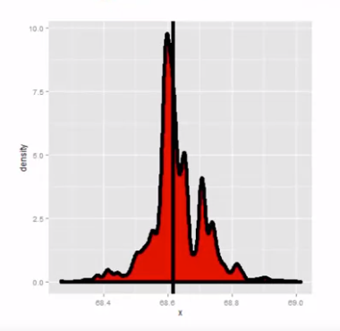

# Week 4

#### Power

Power is the probability of rejecting th null hypothesis when it is false.

> "A type II error is failing to reject the null hypothesis when it is false; the probability of a type II error is usually called $\beta$".

- Note Power $= 1 - \beta$.

**Notes**:

Consider our previous example involving RDI.

- $H_0 : \mu = 30$ *vs*. $H_a : \mu < 30$.
- Then, power is $\textrm P \bigg( \displaystyle\frac{\bar X - 30}{s/\sqrt n} > t_{1-\alpha, \ n-1}\ ;\ \mu = \mu_a \bigg)$.
- Note that this is a function that depends on the specific value of $\mu_a$!
- Notice that as $\mu_a$ approaches $30$, the power approaches $\alpha$.

**Calculating power for Gaussian data**:

We reject if $\displaystyle\frac{\bar X - 30}{\sigma / \sqrt n} > z_{1-\alpha}$.

- Equivalently, if $\bar X > 30 + z_{1-\alpha} \displaystyle\frac{\sigma}{\sqrt n}$.

Under $H_0 : \bar X \sim \mathcal N \bigg(\mu_0, \displaystyle\frac{\sigma^2}{n} \bigg)$.

Under $H_a : \bar X \sim \mathcal N \bigg(\mu_a, \displaystyle\frac{\sigma^2}{n} \bigg)$.

~~~R
z <- qnorm(1-alpha)
power <- pnorm(mu0 + z*sigma/sqrt(n), mean = mua, sd = sigma/sqrt(n), lower.tail = FALSE)
~~~

###### Example:

$$
\mu_a = 32, \quad \mu_0 = 30, \quad n = 16, \quad \sigma = 4
$$

~~~R
mu0 = 30; mua = 32; sigma = 4; n = 16
z <- qnorm(1 - alpha)

pnorm(mu0 + z*sigma/sqrt(n), mean=mu0, sd=sigma/sqrt(n), lower.tail=FALSE)
# 0.05

pnorm(mu0 + z*sigma/sqrt(n), mean=mua, sd=sigma/sqrt(n), lower.tail=FALSE)
# 0.6388
~~~

**Power curve**:

- Power increases:
  - For larger distances from the hypothesized mean $\mu_0$ (that is, as $\mu_a$ grows).
  - For larger samples (*id est*, larger values of $n$).

**Problem**:

When testing $H_a : \mu > \mu_0$, notice if power is $1-\beta$, then:
$$
1-\beta = \textrm P \bigg( \bar X > \mu_0 + z_{1-\alpha} \displaystyle\frac{\sigma}{\sqrt n}\ ;\ \mu = \mu_a \bigg)
$$
where $\bar X \sim \mathcal N (\mu_a,\ \sigma^2/n)$

- Unknowns: $\mu_a, \sigma, n, \beta$
- Knowns: $\mu_0, \alpha$

Specify any three of the unknowns and you can solve for the remainder.

The calculation for $H_a : \mu < \mu_0$ is similar.

For $H_a : \mu \neq \mu_0$ calculate the one sided power using $\alpha/2$ (this is only approximate right, it excludes the probability of getting a large test statistic in the opposite direction of the truth).

**Notes**:

- Power goes up as $\alpha$ gets larger.
- Power of a one sided test is greater than the power of the associated two sided test.
- Power goes up as $\mu_a$ gets further away from $\mu_0$.
- Power goes up as $n$ goes up.
- Power goes up as $\sigma$ goes <u>down</u>.
- Power does not need $\mu_a$, $\sigma$ and $n$, instead only $\displaystyle\frac{\sqrt n (\mu_a - \mu_0)}{\sigma}$:
  - The quantity $\displaystyle\frac{\sqrt n (\mu_a - \mu_0)}{\sigma}$ is called effect size, the difference in the means in standard deviation units.

#### $t$-test power

Consider calculating power for a Gosset's $t$ test for our example.

- The power is $\textrm P \bigg(\displaystyle\frac{\bar X - \mu_0}{S/\sqrt n} > t_{1-\alpha,\ n-1}\ ;\ \mu=\mu_a\bigg)$.
- Calculating this requires the [non-central](https://en.wikipedia.org/wiki/Noncentral_t-distribution) $t$ distribution.
- `power.t.test` does this very well.
  - Omit one of the arguments and it solves for it.

~~~R
power.t.test(n = 16, delta = 2/4, sd = 1, type = "one.sample", alt = "one.sided")$power
# 0.604

power.t.test(n = 16, delta = 2, sd = 4, type = "one.sample", alt = "one.sided")$power
# 0.604

power.t.test(n = 16, delta = 100, sd = 200, type = "one.sample", alt = "one.sided")$power
# 0.604
~~~

- `delta` is the difference between $\mu_a$ and $\mu_0$.
- The same value of power was obtained for the three tests shown in the code snippet above:
  - This stems from the fact that the power depends only on the effect size: $\displaystyle\frac{\sqrt n (\mu_a - \mu_0)}{\sigma}$.

~~~R
power.t.test(power = 0.8, delta = 2/4, sd = 1, type = "one.sample", alt = "one.sided")$n
# 26.14

power.t.test(power = 0.8, delta = 2, sd = 4, type = "one.sample", alt = "one.sided")$n
# 26.14

power.t.test(power = 0.8, delta = 100, sd = 200, type = "one.sample", alt = "one.sided")$n
# 26.14
~~~

- Now we have informed the power to get the needed sample size.

***

### Multiple testing

**Key ideas**:

- Hypothesis testing/significance analysis is commonly overused.
- Correcting for multiple testing avoids false positives or discoveries.
- Two key components:
  - Error measure
  - Correction

**Types of errors**:

Suppose you are testing a hypothesis that a parameter $\beta$ equals zero *versus* the alternative that it does not equal zero. These are the possible outcomes:

|                      | $\beta = 0$ | $\beta \neq 0$ | HYPOTHESES |
| -------------------- | ----------- | -------------- | ---------- |
| Claim $\beta = 0$    | $U$         | $T$            | $m-R$      |
| Claim $\beta \neq 0$ | $V$         | $S$            | $R$        |
| Claims               | $m_0$       | $m-m_0$        | $m$        |

Type I error or false positive ($V$) says the parameter does not equal zero when it does.

Type II error or false negative ($T$) says that the parameter equals zero when it does not.

**Error rates**:

- [False positive rate](https://en.wikipedia.org/wiki/False_positive_rate) - the rate at which false results ($\beta = 0$) are called significant: $\textrm E \bigg[\displaystyle\frac{V}{m_0}\bigg]$.
- Family wise error rate (FWER) - the probability of at least one false positive $\textrm P (V \geq 1)$.
- False discovery rate (FDR) - the rate at which claims of significance are false: $\textrm E \bigg[\displaystyle\frac{V}{R}\bigg]$.

**Controlling the false positive rate**:

If p-values are correctly calculated, calling all $p < \alpha$ significant will control the false positive rate at level $\alpha$ on average.

<u>Problem</u>: Suppose that you perform $10,000$ tests and $\beta=0$ for all of them.

- Suppose that you call all $p < 0.05$ significant.
- The expected number of false positives is $10,000 \times 0.05 = 500$ false positives.
- How do we avoid so many false positives?

**Controlling the family-wise error rate**:

The [Bonferroni correction](https://en.wikipedia.org/wiki/Bonferroni_correction) is the oldest multiple testing correction.

- Basic idea:
  - Suppose you do $m$ tests.
  - You want to control FWER at level $\alpha$ so $\textrm P (V \geq 1) < \alpha$.
  - Calculate p-values normally.
  - Set $\alpha_{\textrm{FWER}} = \alpha/m$.
  - Call all p-values less than $\alpha_{\textrm{FWER}}$ significant.

- <u>Pros</u>: Easy to calculate, conservative.
- <u>Cons</u>: May be very conservative.

**Controlling false discovery rate (FDR)**:

[Benjamini–Hochberg correction](https://en.wikipedia.org/wiki/False_discovery_rate#Benjamini%E2%80%93Hochberg_procedure) (BH): this is the most popular correction when performing lots of  tests, say, in genomics, imagining, astronomy, or other signal-processing disciplines.

- Basic idea:
  - Suppose you do $m$ tests.
  - You want to control FDR at level $\alpha$ so $\textrm E \bigg[ \displaystyle\frac{V}{R} \bigg] < \alpha$.
  - Calculate the p-values normally.
  - Order the p-values from smallest to largest: $p_{(1)}, p_{(2)}, ..., p_{(m)}$.
  - Call any $p_{(i)} \leq \alpha \times \displaystyle\frac{i}{m}$ significant.
- <u>Pros</u>: Still pretty easy to calculate, less conservative (maybe much less).
- <u>Cons</u>: Allows for more false positives, may behave strangely under dependence.

**Adjusted p-values**:

They are not p-values anymore.

- But they can be used directly without adjusting $\alpha$.

Example:

- Suppose p-values are $p_1, ..., p_m$.
- You could adjust them by taking $p_i^{\textrm{FWER}} = \textrm{max }[ m \times p_i\ ,\ 1]$ for each p-value.
- Then you call all $p_i^{\textrm{FWER}} < \alpha$ significant you will control the FWER.

**Case study I**: no true positives

~~~R
set.seed(1010093)
pValues <- rep(NA,1000)
for(i in 1:1000){
    y <- rnorm(20)
    x <- rnorm(20)
    pValues <- summary(lm(y ~ x))$coeff[2,4]
}

# Controls false positive rate
sum(pValues < 0.05)
# 51

# Controls FWER
sum(p.adjust(pValues,method='bonferroni') < 0.05)
# 0

# Controls FDR
sum(p.adjust(pValues,method='BH') < 0.05)
# 0
~~~

**Case study II**: 50% true positives

~~~R
set.seed(1010093)
pValues <- rep(NA,1000)
for(i in 1:1000){
    y <- rnorm(20)
    # First 500 beta=0, last 500 beta=2
    if(i <= 500){
        y <- rnorm(20)
    }else{
        y <- rnorm(20, mean=2*x)
    }
    pValues[i] <- summary(lm(y ~ x))$coeff[2,4]
}

trueStatus <- rep(c('zero','not zero'),each=500)
table(pValues < 0.05, trueStatus)
#      trueStatus
#         not zero    zero
# FALSE          0     476
# TRUE         500      24

# Controls FWER
table(p.adjust(pValues,method='bonferroni') < 0.05, trueStatus)
#      trueStatus
#         not zero    zero
# FALSE         23     500
# TRUE         477       0

# Controls FDR
table(p.adjust(pValues,method='BH') < 0.05, trueStatus)
#      trueStatus
#         not zero    zero
# FALSE          0     487
# TRUE         500      13

~~~

**Notes**:

- A basic Bonferroni/BH correction is usually enough.
- If there is strong dependence between tests there may be problems.
  - Consider `method='BY'` ([Benjamini-Yekutieli procedure](https://en.wikipedia.org/wiki/False_discovery_rate#Benjamini%E2%80%93Yekutieli_procedure)).

***

## Re-sampling

#### Bootstrapping

The bootstrap is a tremendously useful tool for constructing confidence intervals and calculating standard errors for difficult statistics.

- For instance, how would one derive a confidence interval for the  median?

<u>What if we only had one sample</u>?

- We do not know the population.
- We only have one sample mean.

We draw new bootstrap samples from the originally observed one, <u>with replacement</u>.

###### Example

~~~R
library(usingR)
data(father.son)
x <- father.son$sheight
n <- length(x)
B <- 10000
resamples <- matrix(sample(x, n * B, replace = TRUE),B,n)
resampledMedians <- apply(resamples, 1, median)
~~~

**The bootstrap principle**:

Suppose that I have a statistic that estimates some population parameter, but I do not know its sampling distribution.

The bootstrap principle suggests using the distribution defined by the data to approximate its sampling distribution.

- In practice, the bootstrap principle is always carried out using simulation.

The general procedure follows by first simulating complete data sets from the observed data <u>with replacement</u>.

- This is approximately drawing from the sampling distribution of that statistic, at least as far as the data is able to approximate the true population distribution.

Calculate the statistic for each simulated data set.

Use the simulated statistics to either define a confidence interval or take the standard deviation to calculate a standard error.

**Non-parametric bootstrap algorithm**:

Bootstrap procedure for calculating confidence interval for the median from a data set of $n$ observations.

1. Sample $n$ observations **with replacement** from the observed data resulting in one simulated complete data set.
2. Take the median of the simulated data set.
3. Repeat the previous two steps $B$ times, resulting in $B$ simulated medians.
4. These medians are approximately drawn from the sampling distribution of the median of $n$ observations; therefore we can:
   - Draw a histogram of them;
   - Calculate their standard deviation to estimate the standard error of the median.
   - Take the $2.5^{\textrm{th}}$ and $97.5^{\textrm{th}}$ percentiles as a confidence interval for the median.

###### Example:

**Notes on the bootstrap**:

- The bootstrap is non-parametric.
- Better percentile bootstrap confidence intervals correct for bias.
  - See the [bias-corrected and accelerated](https://blogs.sas.com/content/iml/2017/07/12/bootstrap-bca-interval.html) (BCa) interval technique.
- There are lots of variations on bootstrap procedures:
  - The book "[An introduction to the Bootstrap](https://www.amazon.com/Introduction-Bootstrap-Monographs-Statistics-Probability/dp/0412042312)", by Efron & Tibshirani, is a great place to start for both bootstrap and jackknife information.

### Group comparisons

- Consider comparing two independent groups.

#### Permutation tests

- Consider the null hypothesis that the distribution of the observations from each group is the same.
- Then, the group labels are irrelevant.
- Consider a data frame with count and spray.
- Permute the spray (group) labels.
- Recalculate the statistic:
  - Mean difference in counts;
  - Geometric means;
  - $T$ statistic.
- Calculate the percentage of simulations where the simulated statistic was more extreme (toward the alternative) than the observed.

**Variations on permutation testing**:

| DATA TYPE | STATISTIC             | TEST NAME                 |
| --------- | --------------------- | ------------------------- |
| Ranks     | Rank sum              | Rank sum test             |
| Binary    | Hyper-geometric prob. | Fisher's exact test       |
| Raw data  |                       | Ordinary permutation test |

- Also, so-called *randomization tests* are exactly permutation tests, with a different motivation.
- For matched data, one can randomize the signs.
  - For ranks, this results in the signed rank test.
- Permutation strategies work for regression as well.
  - Permuting a regressor of interest.
- Permutation tests work very well in multivariate settings.

**Permutation test B vs C**:

~~~R
subdata <- InsectSprays[InsectSprays$spray %in% c("B","C"),]
y <- subdata$count
group <- as.character(subdata$spray)
testStat <- function(w,g) mean(w[g == "B"]) - mean(w[g == "C"])
observedStat <- testStat(y, group)
permutations <- sapply(1 : 10000, function(i) testStat(y, sample(group)))

print(observedStat)
# 13.25

print(mean(permutations > observedStat))
# 0 -> null REJECTED: there is difference!
~~~

- The histogram displays the null hypothesis distribution.
- The black vertical line indicates the test statistic.
  - The p-value is equivalent to the area of the histogram beyond that vertical line.